create a architecture drawing following the below code:"""# BMS Agentic Workflow - Architecture Diagram

## High-Level Architecture

```mermaid
graph TB
    %% User Layer
    User[👤 Scientists/Researchers]
    
    %% Frontend Layer
    subgraph "Frontend (ClientStack)"
        React[🖥️ React Web App<br/>TypeScript + Vite]
        CF[☁️ CloudFront CDN]
        S3Client[🪣 S3 Static Hosting]
    end
    
    %% API Gateway Layer
    subgraph "API Layer"
        AppSync[🔗 AWS AppSync<br/>GraphQL API]
        Cognito[🔐 Amazon Cognito<br/>User Pool + Identity Pool]
    end
    
    %% Backend Processing Layer
    subgraph "Backend (BackendStack)"
        ResponderLambda[⚡ Responder Lambda<br/>Python 3.11, 10GB, 15min]
        PingLambda[🏓 Ping Lambda<br/>Keep Warm Function]
        DDB[🗄️ DynamoDB<br/>Conversations + Messages]
        DDBStreams[📡 DynamoDB Streams]
    end
    
    %% AI/ML Layer
    subgraph "AI Services"
        BedrockAgent[🤖 Bedrock Agents<br/>Hypothesis Generation<br/>Compound Selection]
        SageMaker[🧠 SageMaker Endpoints<br/>Boltz Protein Prediction<br/>ADMET Analysis]
        KnowledgeBase[📚 Bedrock Knowledge Base<br/>Scientific Literature]
    end
    
    %% Specialized Lambda Functions
    subgraph "Scientific Computing Lambdas"
        HypothesisLambda[🧪 Hypothesis Generator Lambda]
        CompoundLambda[💊 Compound Selection Lambda]
        ADMETLambda[🔬 ADMET Inference Lambda]
        RDKitLambda[⚗️ RDKit Analysis Lambda]
        ClusteringLambda[📊 Clustering Lambda]
    end
    
    %% Data Storage
    subgraph "Data Storage"
        S3Data[🪣 S3 Buckets<br/>Chemical Libraries<br/>Caches<br/>PDF Uploads<br/>Results]
        LambdaLayers[📦 Lambda Layers<br/>Scientific Libraries<br/>RDKit, Pandas, etc.]
    end
    
    %% VPC and Networking
    subgraph "Network (Optional VPC)"
        VPC[🌐 Custom VPC]
        PrivateSubnets[🔒 Private Subnets]
        SecurityGroups[🛡️ Security Groups]
    end
    
    %% Monitoring
    subgraph "Monitoring"
        CloudWatch[📈 CloudWatch<br/>Logs + Metrics]
        XRay[🔍 X-Ray Tracing]
    end
    
    %% User Interactions
    User --> React
    React --> CF
    CF --> S3Client
    React --> AppSync
    AppSync --> Cognito
    
    %% Authentication Flow
    Cognito --> AppSync
    
    %% Backend Processing
    AppSync --> DDB
    DDB --> DDBStreams
    DDBStreams --> ResponderLambda
    
    %% AI Processing
    ResponderLambda --> BedrockAgent
    BedrockAgent --> HypothesisLambda
    BedrockAgent --> CompoundLambda
    BedrockAgent --> KnowledgeBase
    
    %% Scientific Computing
    HypothesisLambda --> SageMaker
    CompoundLambda --> ADMETLambda
    ADMETLambda --> RDKitLambda
    RDKitLambda --> ClusteringLambda
    
    %% Data Access
    ResponderLambda --> S3Data
    HypothesisLambda --> S3Data
    CompoundLambda --> S3Data
    ADMETLambda --> S3Data
    
    %% Lambda Layers
    HypothesisLambda -.-> LambdaLayers
    CompoundLambda -.-> LambdaLayers
    ADMETLambda -.-> LambdaLayers
    RDKitLambda -.-> LambdaLayers
    
    %% Keep Warm
    PingLambda --> ResponderLambda
    
    %% VPC Integration (Optional)
    ResponderLambda -.-> VPC
    VPC --> PrivateSubnets
    VPC --> SecurityGroups
    
    %% Monitoring
    ResponderLambda --> CloudWatch
    HypothesisLambda --> CloudWatch
    CompoundLambda --> CloudWatch
    BedrockAgent --> CloudWatch
    
    %% Styling
    classDef frontend fill:#e1f5fe
    classDef backend fill:#f3e5f5
    classDef ai fill:#e8f5e8
    classDef data fill:#fff3e0
    classDef network fill:#fce4ec
    classDef monitor fill:#f1f8e9
    
    class React,CF,S3Client frontend
    class ResponderLambda,PingLambda,DDB,DDBStreams,AppSync,Cognito backend
    class BedrockAgent,SageMaker,KnowledgeBase,HypothesisLambda,CompoundLambda,ADMETLambda,RDKitLambda,ClusteringLambda ai
    class S3Data,LambdaLayers data
    class VPC,PrivateSubnets,SecurityGroups network
    class CloudWatch,XRay monitor
```

## Data Flow Diagram

## Component Interaction Details

### 1. Authentication Flow

### 2. Message Processing Flow

### 3. Scientific Computing Pipeline

## Infrastructure Deployment Architecture

```mermaid
graph TB
    subgraph "CDK Application"
        CDKApp[📁 CDK App<br/>TypeScript]
        
        subgraph "Client Stack"
            ClientInfra[🏗️ Client Infrastructure<br/>S3 + CloudFront]
        end
        
        subgraph "Backend Stack"
            BackendInfra[🏗️ Backend Infrastructure<br/>Lambda + DDB + AppSync]
            AuthInfra[🏗️ Auth Infrastructure<br/>Cognito Resources]
        end
        
        subgraph "Python Infrastructure"
            PythonCDK[🐍 Python CDK Components<br/>Bedrock Agents<br/>Lambda Functions<br/>SageMaker Endpoints]
        end
    end
    
    subgraph "Deployment Pipeline"
        DeployScript[🚀 deploy.py<br/>Orchestration Script]
        EnvConfig[⚙️ Environment Config<br/>dev.env]
        VPCConfig[🌐 VPC Configuration<br/>Optional Corporate Network]
    end
    
    subgraph "AWS Account"
        Region[🌍 AWS Region<br/>us-east-1]
        
        subgraph "Compute Resources"
            LambdaFunctions[⚡ Lambda Functions]
            SageMakerEndpoints[🧠 SageMaker Endpoints]
        end
        
        subgraph "Storage Resources"
            DynamoDBTables[🗄️ DynamoDB Tables]
            S3Buckets[🪣 S3 Buckets]
        end
        
        subgraph "AI/ML Resources"
            BedrockAgents[🤖 Bedrock Agents]
            KnowledgeBases[📚 Knowledge Bases]
        end
    end
    
    CDKApp --> DeployScript
    DeployScript --> EnvConfig
    DeployScript --> VPCConfig
    
    ClientInfra --> Region
    BackendInfra --> Region
    AuthInfra --> Region
    PythonCDK --> Region
    
    Region --> LambdaFunctions
    Region --> SageMakerEndpoints
    Region --> DynamoDBTables
    Region --> S3Buckets
    Region --> BedrockAgents
    Region --> KnowledgeBases
```

## Security Architecture

```mermaid
graph TB
    subgraph "Identity & Access"
        IAM[🔐 IAM Roles & Policies]
        Cognito[👤 Cognito User Management]
        JWT[🎫 JWT Token Validation]
    end
    
    subgraph "Network Security"
        VPC[🌐 VPC Isolation]
        SecurityGroups[🛡️ Security Groups]
        NACL[🚧 Network ACLs]
        HTTPS[🔒 HTTPS/TLS Encryption]
    end
    
    subgraph "Data Security"
        Encryption[🔐 Encryption at Rest]
        SSL[🔒 SSL in Transit]
        S3Policies[📋 S3 Bucket Policies]
        DDBEncryption[🗄️ DynamoDB Encryption]
    end
    
    subgraph "Application Security"
        OwnerAuth[👥 Owner-based Authorization]
        GraphQLAuth[🔗 GraphQL Field Security]
        LambdaPerms[⚡ Lambda Execution Roles]
    end
    
    IAM --> VPC
    Cognito --> JWT
    JWT --> OwnerAuth
    OwnerAuth --> GraphQLAuth
    
    VPC --> SecurityGroups
    SecurityGroups --> NACL
    HTTPS --> SSL
    
    Encryption --> DDBEncryption
    SSL --> S3Policies
    GraphQLAuth --> LambdaPerms
```

This architecture provides a comprehensive, scalable, and secure foundation for AI-powered drug discovery workflows, leveraging AWS's managed services for optimal performance and cost-effectiveness."""